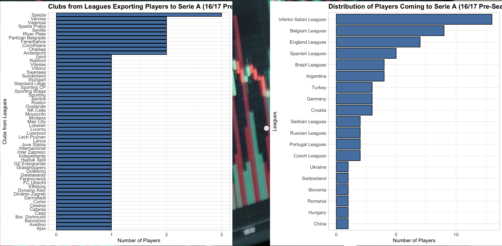
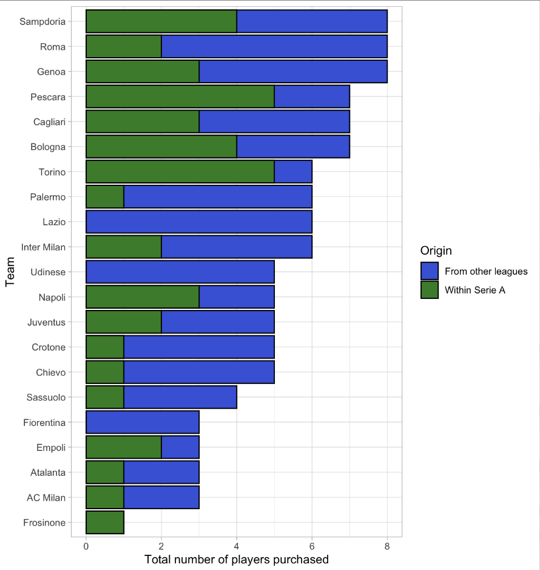

# Transfer Network Analysis of Serie A

> Final project for **Data Management – Unit 2**,
> exploring the Italian Serie A transfer market through **network science**, **graph theory**, and **data mining** in **R**.
To view the full  presentation of the project:
> https://prezi.com/p/fgatikcnbslg/network-analysis-of-serie-a-teams-summer-transfer-season-2016-2017/

This project was developed as part of the **Data Management Unit 2** course at Sapienza University of Rome.  
Theoretical foundation and methodologies were inspired by:
> **Barabási, A.-L. (2016). *Network Science*. Cambridge University Press.**


##  Project Overview
The goal was to model and analyze the **Serie A 2016–17 summer transfer market**  
By analyzing structural properties (degree, clustering, connectedness) and comparing with league results,  
the project uncovers how **transfer activity and club influence** correlate with **on-field performance**.


##  Methodology

### 1️ Data Sources
- `transfer_data.csv` — transfers dataset  
- `SerieAclassifica15-16.csv` — previous season standings  
- `SerieAclassifica16-17.csv` — current season results  
- `SerieA16-17predictedtableBBC.csv` — predicted rankings (BBC dataset)
- `example2.R` -  R script for data analysis and visualization.

### 2️ Tools & Libraries
All analysis was performed in **R**, using:
```r
library(dplyr)
library(tidyr)
library(ggplot2)
library(igraph)
library(network)
library(intergraph)
library(readr)
```
### 3 Getting started
Clone the repo and open the project folder.

Install all dependencies listed in project.R.

Run example2.R in RStudio to reproduce the analyses and visual outputs.


##  Highlights

<p align="center">
  
</p>

**Figure:** Visualization of the Serie A 2016–17 summer transfer network.  
Each **yellow node** represents a football club.  
If a club has **no yellow circle**, it means it **did not participate** in any Serie A transfer during this season  
(either no incoming or no outgoing players, depending on the graph orientation).

- 🔴 **Red links** — more than **2 players** transferred  
- 🟢 **Green links** — **2 players** transferred  
- ⚫️ **Black links** — **1 player** transferred  

---

### Network Statistics

| Metric | Value |
|:-----------------------------|:------:|
| **Number of nodes** | 22 |
| **Number of links** | 38 |
| **Average degree** | 1.73 |
| **Degree distribution** | 0.14, 0.36, 0.27, 0.14, 1.00, 0.05, 0.05 |
| **Average clustering coefficient** | 0.15 |

<p align="center">
  
</p>

**Figure 1.** *Transfer activity trends for Serie A teams (2014–2024).*  
Comparison of transfers **within Serie A** vs. **from other leagues**,  
showing a gradual increase in international transfers over time.

<p align="center">
  
</p>

**Figure 2.** *Top exporting clubs and leagues contributing players to Serie A (2016–17 pre-season).*  
Highlights major source leagues such as **Belgium**, **England**, and **Spain**,  
and the Italian lower divisions as key domestic suppliers.

<p align="center">
  
</p>

**Figure 3.** *Breakdown of total players purchased by Serie A clubs (2016–17 season).*  
Blue bars indicate signings **from other leagues**, while green bars show **intra-Serie A transfers**.  


